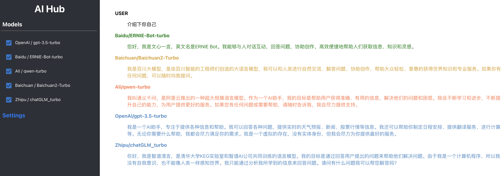

# AI Hub Project

## 简介

AI Hub 是一个为了接入多种大型语言模型而设计的服务。它旨在积累和管理各种有效的模型调用提示（prompt），并对这些大型语言模型进行持续的测试和评估。

已支持模型列表：
1. OpenAI / gpt-3.5-turbo
2. Baidu / ERNIE-Bot-turbo
3. Ali / qwen-turbo
4. Tencent / ChatPro
5. Baichuan / Baichuan2-Turbo
6. Zhipu / chatGLM_turbo
7. Minimax / abab5.5-chat
8. Xunfei / Spark3.1




使用前请在 Settings 页面设置模型的 credentials：


## 安装

### 数据库
```sql
CREATE DATABASE `ai_hub`;

CREATE TABLE `api_credential` (
    `id` INT AUTO_INCREMENT PRIMARY KEY,
    `provider` INT NOT NULL,
    `key` VARCHAR(255) NOT NULL,
    `value` VARCHAR(1024) NOT NULL,
    `updated_at` TIMESTAMP DEFAULT CURRENT_TIMESTAMP ON UPDATE CURRENT_TIMESTAMP,
    UNIQUE(`provider`, `key`)
);
```

### 前端
```shell
cd ai-hub-fe
npm run start
```

### 服务端
需要 JDK 11 以上版本
```shell
cd ai-hub-server
mvn clean package
java -jar ai-hub-server-1.0.0-SNAPSHOT-exec.jar
```

## 测试集

### [翻译](docs/use_cases/translation/)
### [编程](docs/use_cases/coding/)
### z-bench 测试集
