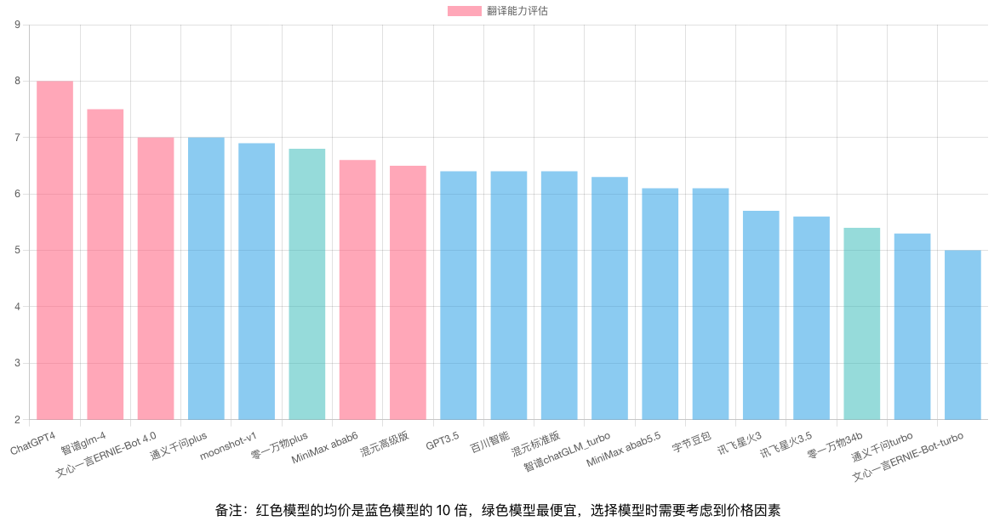

# AI Hub Project

## 简介

AI Hub旨在持续测试和评估主流大型语言模型，同时积累和管理各种有效的模型调用提示（prompt）。目前，AI Hub已接入国内所有主流的大型语言模型，包括文心一言、腾讯混元、智谱AI、MiniMax、百川智能等，并计划持续追踪、接入和评估新模型。

已支持模型列表：
1. OpenAI / gpt-3.5-turbo
2. Baidu / ERNIE-Bot-turbo（文心一言）
3. Ali / qwen-turbo（通义千问）
4. Tencent / ChatStd（腾讯混元）
5. Baichuan / Baichuan2-Turbo（百川）
6. Zhipu / chatGLM_turbo（智谱）
7. Minimax / abab5.5-chat（MiniMax）
8. Xunfei / Spark3.1（讯飞星火）
9. Tencent / ChatPro（腾讯混元）
10. Minimax / abab6-chat（MiniMax）
11. OpenAI / gpt-4-1106-preview
12. Zhipu / glm-4（智谱GLM-4）


使用前请在 Settings 页面设置模型的 credentials：


如果你想参考这个项目的代码，自己接入列表中的大模型，可以参考[这里](ai-hub-server/src/main/java/com/github/xielong/aihub/adapter)

## 评估结果
### 英文翻译


## 安装

### 数据库
```sql
CREATE DATABASE `ai_hub`;

CREATE TABLE `api_credential` (
    `id` INT AUTO_INCREMENT PRIMARY KEY,
    `provider` INT NOT NULL,
    `key` VARCHAR(255) NOT NULL,
    `value` VARCHAR(1024) NOT NULL,
    `updated_at` TIMESTAMP DEFAULT CURRENT_TIMESTAMP ON UPDATE CURRENT_TIMESTAMP,
    UNIQUE(`provider`, `key`)
);

CREATE TABLE `model_answer` (
    `id` INT AUTO_INCREMENT PRIMARY KEY,
    `question_hash` CHAR(64) NOT NULL,
    `question` TEXT NOT NULL,
    `provider` INT NOT NULL,
    `model_name` VARCHAR(255) NOT NULL,
    `answer` TEXT NOT NULL,
    `rating` TINYINT UNSIGNED,
    `comment` TEXT,
    `updated_at` TIMESTAMP DEFAULT CURRENT_TIMESTAMP ON UPDATE CURRENT_TIMESTAMP,
    INDEX(`question_hash`, `model_name`)
);
```

### 前端
```shell
cd ai-hub-fe
npm run start
```

### 服务端
需要 JDK 11 以上版本
```shell
cd ai-hub-server
mvn clean package
java -jar ai-hub-server-1.0.0-SNAPSHOT-exec.jar
```

## 测试集

### [翻译](docs/use_cases/translation/)
### [编程](docs/use_cases/coding/)
### z-bench 测试集


## 价格

| Company | Model                   | Price                    | Notes                                           |
|---------|-------------------------|--------------------------|-------------------------------------------------|
| MiniMax | abab6                   | 0.2元/千tokens        |                                   |
| MiniMax | abab5.5                 | 0.015元/千tokens      |                                   |
| Zhipu   | GLM-4                   | 0.1元/千tokens           |                                   |
| Zhipu   | GLM-3-Turbo             | 0.005元/千tokens         |                                   |
| Ali     | qwen-turbo              | 0.008元/千tokens     |                                                 |
| Baichuan| Baichuan2-Turbo         | 0.008元/千tokens         |                                   |
| OpenAI  | gpt-4-1106-preview      | $0.01/1k tokens(input)&nbsp;&nbsp;$0.03/1k tokens (output)    |                       |
| OpenAI  | gpt-3.5-turbo-1106      | $0.001/1k tokens (input)&nbsp;&nbsp;$0.0020/1k tokens (output)  |                    |
| Baidu   | ERNIE-Bot-turbo         | 0.012元/千tokens         |                                                 |
| Baidu   | ERNIE-Bot 4.0           | 0.12元/千tokens          |                                                 |
| Tencent | ChatStd     | 0.01元/千tokens     | 赠10万token的免费调用额度，有效期12个月        |
| Tencent | ChatPro     | 0.10元/千tokens    | 赠10万token的免费调用额度，有效期12个月        |
| Xunfei  | Spark3.1             | 0.03元/千tokens           | 企业赠500万token的免费调用额度，有效期12个月   |
