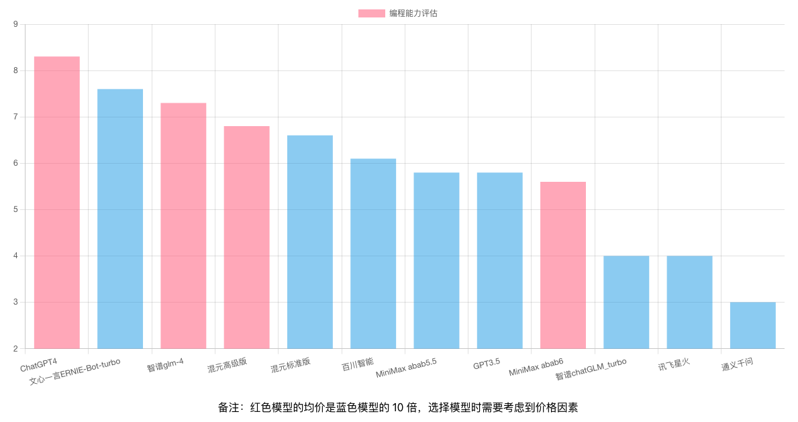

# AI Hub Project

## 简介

AI Hub旨在持续测试和评估主流大型语言模型，同时积累和管理各种有效的模型调用提示（prompt）。目前，AI Hub已接入国内所有主流的大型语言模型，包括文心一言、腾讯混元、智谱AI、MiniMax、百川智能等，并计划持续追踪、接入和评估新模型。

已支持模型列表：
1. OpenAI / gpt-4-1106-preview
2. OpenAI / gpt-3.5-turbo
3. Baidu / ERNIE-Bot-4（文心一言4）
4. Baidu / ERNIE-Bot-turbo（文心一言）
5. Zhipu / glm-4（智谱GLM-4）
6. Zhipu / chatGLM_turbo（智谱chatGLM）
7. Ali / qwen-plus（通义千问plus）
8. Ali / qwen-turbo（通义千问）
9. Tencent / ChatPro（腾讯混元高级版）
10. Tencent / ChatStd（腾讯混元标准版）
11. Baichuan / Baichuan2-Turbo（百川）
12. Minimax / abab5.5-chat（MiniMax）
13. Minimax / abab6-chat（MiniMax）
14. Xunfei / Spark3.1（讯飞星火）


使用前请在 Settings 页面设置模型的 credentials：


## 评估结果
### 英文翻译
[测试用例看这里](docs/use_cases/translation/)


### 编程
[测试用例看这里](docs/use_cases/coding/)


这里不需要大量测试用例。只需难度各异的随机测试，就能明显察觉各大模型在体验上的差异。如果某模型在部分测试数据中表现优异，相较于表现欠佳的模型，其优势一目了然。

## 大模型接入
如果你想自己接入列表中的大模型，可以通过以下方式。
### Rest 服务
启动 ai-hub-server，访问
```http
http://127.0.0.1:3000/api/v1/models/${provider}/${model}:chat
```
Post:
```json
{
    "input": "${input}"
}
```
### Java 代码接入
可以参考[这里](ai-hub-server/src/main/java/com/github/xielong/aihub/adapter)
```java
@Service
public class AIModelInvokerFactory {

    private final ApplicationContext context;

    @Autowired
    public AIModelInvokerFactory(ApplicationContext context) {
        this.context = context;
    }

    public AIModelInvoker getProviderAdapter(String providerName) {
        AIProvider provider = AIProvider.fromName(providerName);

        switch (provider) {
            case OPENAI:
                return context.getBean(OpenAIInvoker.class);
            case BAICHUAN:
                return context.getBean(BaichuanInvoker.class);
            case ALI:
                return context.getBean(AliInvoker.class);
            case BAIDU:
                return context.getBean(BaiduInvoker.class);
            case ZHIPU:
                return context.getBean(ZhipuInvoker.class);
            case TENCENT:
                return context.getBean(TencentInvoker.class);
            case XUNFEI:
                return context.getBean(XunfeiInvoker.class);
            case MINIMAX:
                return context.getBean(MiniMaxInvoker.class);
            default:
                throw new IllegalArgumentException("Unknown provider: " + provider);
        }
    }

}

```

## 运行

### Docker
推荐使用 docker-compose 启动服务
```shell
cd docker
docker-compose up -d
```

### 数据库
参考[脚本](docker/init-db/init.sql)

### 前端
```shell
cd ai-hub-fe
npm run start
```

### 服务端
需要 JDK 11 以上版本
```shell
cd ai-hub-server
mvn clean package
java -jar ai-hub-server-1.0.0-SNAPSHOT-exec.jar
```

## 测试集

### [翻译](docs/use_cases/translation/)
### [编程](docs/use_cases/coding/)
### z-bench 测试集

## 价格

| Company | Model                   | Price                    | Notes                                           |
|---------|-------------------------|--------------------------|-------------------------------------------------|
| MiniMax | abab6                   | 0.2元/千tokens        |                                   |
| MiniMax | abab5.5                 | 0.015元/千tokens      |                                   |
| Zhipu   | GLM-4                   | 0.1元/千tokens           |                                   |
| Zhipu   | GLM-3-Turbo             | 0.005元/千tokens         |                                   |
| Ali     | qwen-plus              | 0.02元/千tokens     |
| Ali     | qwen-turbo              | 0.008元/千tokens     |  
| Baichuan| Baichuan2-Turbo         | 0.008元/千tokens         |                                   |
| OpenAI  | gpt-4-1106-preview      | $0.01/1k tokens(input)&nbsp;&nbsp;$0.03/1k tokens (output)    |                       |
| OpenAI  | gpt-3.5-turbo-1106      | $0.001/1k tokens (input)&nbsp;&nbsp;$0.0020/1k tokens (output)  |                    |
| Baidu   | ERNIE-Bot-turbo         | 0.012元/千tokens         |                                                 |
| Baidu   | ERNIE-Bot 4.0           | 0.12元/千tokens          |                                                 |
| Tencent | ChatStd     | 0.01元/千tokens     | 赠10万token的免费调用额度，有效期12个月        |
| Tencent | ChatPro     | 0.10元/千tokens    | 赠10万token的免费调用额度，有效期12个月        |
| Xunfei  | Spark3.1             | 0.03元/千tokens           | 企业赠500万token的免费调用额度，有效期12个月   |
