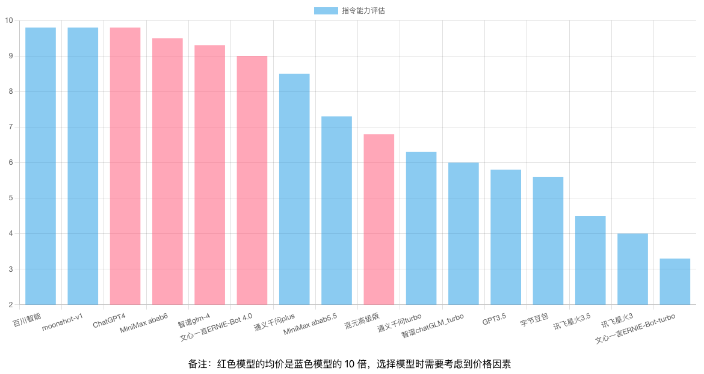

# AI Hub Project

## 简介

AI Hub旨在持续测试和评估主流大型语言模型，同时积累和管理各种有效的模型调用提示（prompt）。目前，AI Hub已接入国内所有主流的大型语言模型，包括文心一言、腾讯混元、智谱AI、MiniMax、百川智能等，并计划持续追踪、接入和评估新模型。

已支持模型列表：
1. OpenAI / gpt-4-turbo
2. OpenAI / gpt-3.5-turbo
3. Baidu / ERNIE-Bot-4（文心一言4）
4. Baidu / ERNIE-Bot-turbo（文心一言）
5. Zhipu / glm-4（智谱GLM-4）
6. Zhipu / chatGLM_turbo（智谱chatGLM）
7. Ali / qwen-plus（通义千问plus）
8. Ali / qwen-turbo（通义千问）
9. Tencent / ChatPro（腾讯混元）
10. Tencent / ChatStd（腾讯混元）
11. Tencent / hunyuan-lite（腾讯混元)
12. Baichuan / Baichuan2-Turbo（百川）
13. Minimax / abab5.5-chat（MiniMax）
14. Minimax / abab6-chat（MiniMax）
15. Xunfei / Spark3.1（讯飞星火）
16. Moonshot / moonshot-v1-8k (月之暗面)
17. Xunfei / Spark3.5 (讯飞星火3.5)
18. ByteDance / Skylark-chat (字节豆包)
19. Lingyi / yi-34b-chat-0205 (零一万物)
20. Lingyi / yi-34b-chat-200k (零一万物)
21. Lingyi / yi-vl-plus (零一万物)
22. Deepseek / DeepSeek-V2 (Deepseek)
23. Baidu / ERNIE-Lite-8K（文心一言）
24. Baidu / ERNIE-Speed-8K（文心一言）

在 [大模型列表](#大模型列表) 部分，有更完整的大语言模型列表。请注意，其中的一些大语言模型尚未经过评估，我将陆续对这些模型进行评估。


使用前请在 Settings 页面设置模型的 credentials：


## 评估结果
### 英文翻译
[测试用例看这里](docs/use_cases/translation/)


### 编程
[测试用例看这里](docs/use_cases/coding/)


### 指令输出
[测试用例看这里](docs/use_cases/instruction/)



## 大模型接入
如果你想自己接入列表中的大模型，可以通过以下方式。
### Rest 服务
启动 ai-hub-server，访问
```http
http://127.0.0.1:3000/api/v1/models/${provider}/${model}:chat
```
Post:
```json
{
    "input": "${input}"
}
```
### Java 代码接入
可以参考[这里](ai-hub-server/src/main/java/com/github/xielong/aihub/adapter)
```java
@Service
public class AIModelInvokerFactory {

    private final ApplicationContext context;

    @Autowired
    public AIModelInvokerFactory(ApplicationContext context) {
        this.context = context;
    }

    public AIModelInvoker getProviderAdapter(String providerName) {
        AIProvider provider = AIProvider.fromName(providerName);

        switch (provider) {
            case OPENAI:
                return context.getBean(OpenAIInvoker.class);
            case BAICHUAN:
                return context.getBean(BaichuanInvoker.class);
            case ALI:
                return context.getBean(AliInvoker.class);
            case BAIDU:
                return context.getBean(BaiduInvoker.class);
            case ZHIPU:
                return context.getBean(ZhipuInvoker.class);
            case TENCENT:
                return context.getBean(TencentInvoker.class);
            case XUNFEI:
                return context.getBean(XunfeiInvoker.class);
            case MINIMAX:
                return context.getBean(MiniMaxInvoker.class);
            default:
                throw new IllegalArgumentException("Unknown provider: " + provider);
        }
    }

}

```

## 运行

### Docker
推荐使用 docker-compose 启动服务
```shell
cd docker
docker-compose up -d
```

### 数据库
参考[脚本](docker/init-db/init.sql)

### 前端
```shell
cd ai-hub-fe
npm run start
```

### 服务端
需要 JDK 11 以上版本
```shell
cd ai-hub-server
mvn clean package
java -jar ai-hub-server-1.0.0-SNAPSHOT-exec.jar
```

## 测试集

### [翻译](docs/use_cases/translation/)
### [编程](docs/use_cases/coding/)
### z-bench 测试集

## 大模型列表

### 低成本模型

| Company   | Model          | Price(1M tokens)    | Context Length |
|-----------|----------------|---------------------|----------------|
| Baidu     | ERNIE Speed    | 免费                | 8k             |
| Baidu     | ERNIE Lite     | 免费                | 8k             |
| Tencent   | hunyuan-lite   | 免费                | 256k           |
| ByteDance | Doubao-lite    | Input: 0.3 \| Output: 0.6 | 32k     |
| Zhipu     | GLM-3-Turbo    | 1                   | 128k           |
| Lingyi    | yi-spark       | 1                   | 16k            |
| Ali       | qwen-long      | Input: 0.5 \| Output: 2 | 10m      |
| ByteDance | Doubao-pro     | Input: 0.8 \| Output: 2 | 32k     |
| DeepSeek  | deepseek-chat  | Input: 1 \| Output: 2  | 32k     |
| Lingyi    | yi-medium      | 2.5                 | 16k            |

### 中低成本模型

| Company   | Model          | Price(1M tokens)    | Context Length |
|-----------|----------------|---------------------|----------------|
| Ali       | qwen-turbo     | Input: 2 \| Output: 6  | 8k          |
| Tencent   | hunyuan-standard | Input: 4.5 \| Output: 5 | 32k    |
| MiniMax   | abab5.5s       | 5                   | 8k             |
| OpenAI    | GPT-3.5 Turbo  | Input: $0.50 \| Output: $1.50 | 16k |
| ByteDance | Doubao-pro-128k | Input: 5 \| Output: 9 | 128k   |
| Baichuan  | Baichuan2-Turbo | 8                  | 32k            |
| MiniMax   | abab6.5s       | 10                  | 245k           |
| Ali       | qwen-plus      | Input: 4 \| Output: 12 | 32k     |
| Baidu     | ERNIE 3.0      | 12                  | 8k             |
| Baichuan  | Baichuan3-Turbo | 12                 | 32k            |
| Lingyi    | yi-large-turbo | 12                  | 16k            |
| Lingyi    | yi-medium-200k | 12                  | 200k           |
| Moonshot  | moonshot-v1-8k | 12                  | 8k             |

### 中高成本模型

| Company   | Model              | Price(1M tokens)    | Context Length |
|-----------|--------------------|---------------------|----------------|
| Moonshot  | moonshot-v1-32k    | 24                  | 32k            |
| Baichuan  | Baichuan3-Turbo-128k | 24                | 128k           |
| MiniMax   | abab6.5            | 30                  | 8k             |
| Tencent   | hunyuan-standard-256k | Input: 15 \| Output: 60 | 256k |
| Moonshot  | moonshot-v1-128k   | 60                  | 128k           |

### 高成本模型

| Company   | Model              | Price(1M tokens)    | Context Length |
|-----------|--------------------|---------------------|----------------|
| OpenAI    | GPT-4o             | Input: $5 \| Output: $15 | 128k     |
| Baidu     | ERNIE-3.5-128k     | Input: 48 \| Output: 96 | 128k     |
| Tencent   | hunyuan-pro        | Input: 30 \| Output: 100 | 32k     |
| Ali       | qwen-max           | Input: 40 \| Output: 120 | 8k      |
| Zhipu     | GLM-4              | 100                 | 128k           |
| Baichuan  | Baichuan4          | 100                 | 32k            |
| Baidu     | ERNIE 4.0          | 120                 | 8k             |